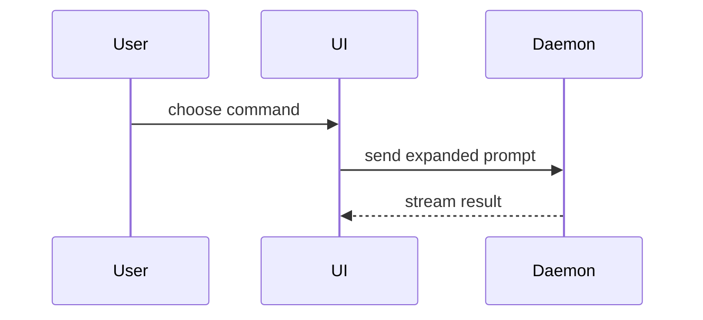

# PR

## Workflow

1. Find the pull request for the current branch with `gh pr view --json number,url,baseRefName`. If no PR exists, use the default branch as the base.
2. Read the complete diff against the base branch. Read enough surrounding code to explain behavior and ownership.
3. Collect proof for the Evidence section:
   - For a visual change, read [references/screenshots.md](references/screenshots.md) before capture. Follow it for capture, pair validation, format, and upload. Use the bundled `control-ui` skill for Agent Browser capture.
   - If the branch already contains the change, capture the before state from a `git worktree` of the base branch.
   - For a non-visual change, run the test or command that fails before the change and passes after it.
   - If the environment cannot render the changed UI, use execution evidence and state that limitation in the Evidence section.
4. Write the body with the template in the Template section. Save it to a file, for example `/tmp/pr-body.md`.
   - For visual evidence, put the screenshot table from `references/screenshots.md` in the Evidence section.
   - Place execution evidence below the table in the template's Before/After list.
5. Publish the body:
   - If the PR exists, run `gh pr edit <number> --body-file /tmp/pr-body.md`.
   - If no PR exists, push the branch and run `gh pr create --body-file /tmp/pr-body.md`.
   - Add one `--attach <path>` flag for each local image or video that the body references.
   - For Azure DevOps, upload media with the attachment API in `references/screenshots.md`.
   - If the user asks only for the body text, return it and skip publication.
6. Open the published PR. Confirm that each section renders and each image or video loads.
   - If `gh` exits with a non-zero status, identify the failed attachments and publish again.

When the task only attaches media to an issue or comment, follow `references/screenshots.md` and skip the template.

## Template

Use this template for writing the PR body:

```markdown
## Summary

<diagram, diff-sketch, or tree>

## Evidence

- **Before:** <screenshot/output/failing test run>
  **After:** <screenshot/output/passing test run>

## Merge Danger

**Door:** <one-way or two-way>

<optional: description>

**Blast Radius:** <one-word description>

<optional: potential ramifications of merge>
```

## Sections

Skip all preambles and keep prose brief. Use the user's domain language from `GLOSSARY.md`.

### Summary

Pick the smallest view that makes the key point clear.

- Show logic or an algorithm as pseudocode:

```text
on(save)
  if content is unchanged
    return cached result
  write new content
  return fresh result
```

- Show runtime control flow as a call tree:

```text
submitForm
  createSession
    persistPrompt
    launchAgent
  navigateToSession
```

- Show UI structure as a component tree, including state and module boundaries that matter:

```text
<SessionPage> (apps/example/src/routes/session.tsx)
  useSessionEvents()
  <SessionToolbar>
    <RunSkillButton> (packages/ui)
```

- Show file responsibility or a broad refactor as a shallow file tree:

```text
src/
├── commands/       # parses user actions
├── sessions/       # owns session state
└── transport/      # sends API requests
```

- Show component interaction, control flow, or data flow with Mermaid:



- Use `diff` when the point is what changes and the surrounding shape already exists. Match the diff shape to the topic.

For a component change:

```diff
 <SessionPage>
   useSessionEvents()
   <SessionToolbar>
+    <RunSkillButton />
   <SessionTimeline>
+    <SkillResultCard />
```

For a file-layout change:

```diff
 src/
 ├── commands/
+│   └── show-me.ts       # expands the slash command
 ├── sessions/
-└── transport.ts
+└── transport/
+    ├── client.ts
+    └── stream.ts
```

For a call-tree or call-stack change:

```diff
 submitForm
   createSession
     persistPrompt
+    expandSkillMention
     launchAgent
-  navigateToSession
+  navigateToSession
+    subscribeToEvents
```

For a state or control-flow change:

```diff
 on(save)
-  write content
+  if content is unchanged
+    return cached result
+  write new content
+  invalidate cache
```

- Show the whole block when most of it is new, when omitted context would hide ownership or order, or when the user needs a copyable target shape:

```ts
function expandSkill(command: string): string {
  const skillName = command.slice(1);
  return `use the ${skillName} skill`;
}
```

#### Guidance

Place each visual next to the short text it supports. Keep only the calls, files, props, states, and boundaries needed to answer the user's current question or the options to resolve the current discussion point.

You may use one of these, you may use several, it is unlikely you will use all of them. Use your judgement and don't overwhelm the user.

### Evidence

Concrete evidence that the change works. Show a before and after.

Screenshots are S-tier - when the environment is set up for it and the change is visual.

Execution-based evidence is A-tier. Test results, console output. Show the exact test that now fails and passes, using pseudocode.

### Merge Danger

Describe whether it's a one-way or two-way door. You can walk back through two-way doors, but not one-way doors. A PR that is cheap to roll back is lower risk. Changes that involve destructive actions or hard-to-reverse decisions are one-way doors.

The blast radius is the potential impact or scope of the changes introduced by this PR. Consider all possibilities. Examples are layout shift, breakages for consumers, mobile responsiveness, etc.
